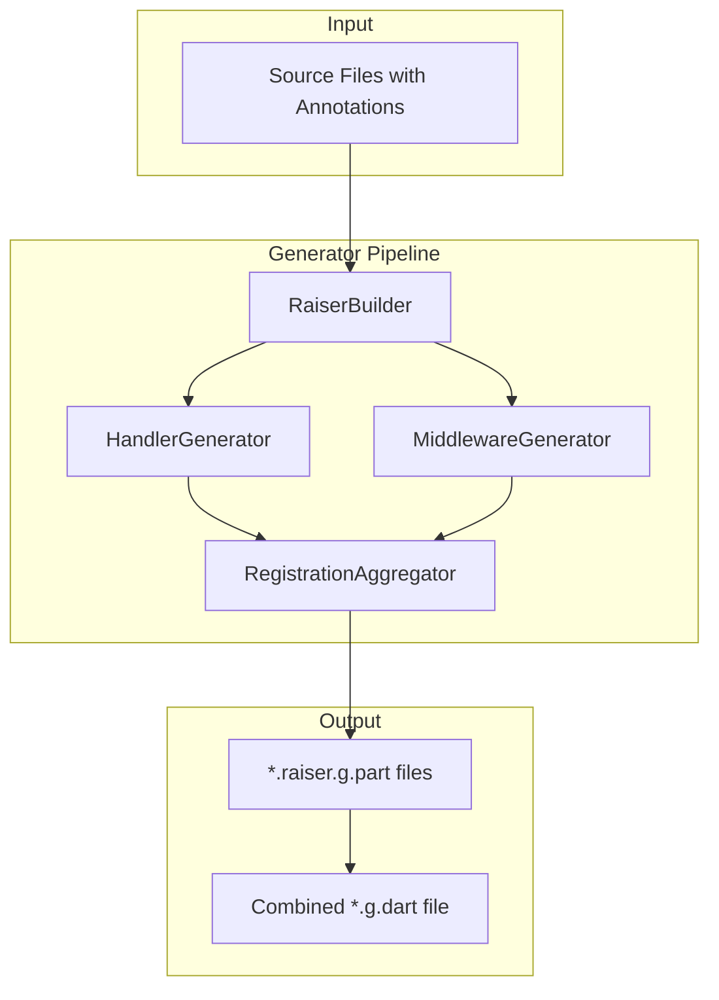

# Design Document: Raiser Code Generator

## Overview

The Raiser Code Generator is a `build_runner` package that auto-discovers classes annotated with `@RaiserHandler` and `@RaiserMiddleware`, then generates registration code. This eliminates manual handler/middleware registration boilerplate, allowing developers to simply annotate their classes and run `dart run build_runner build` to get a fully wired event system.

The generator uses Dart's `source_gen` and `analyzer` packages to inspect source files, extract annotation metadata, resolve generic type parameters, and produce well-formatted Dart code.

## Architecture



The generator follows a multi-phase approach:
1. **Discovery Phase**: Scan source files for annotated classes
2. **Validation Phase**: Verify annotations are correctly applied
3. **Extraction Phase**: Extract metadata (priority, busName, event type, constructor params)
4. **Generation Phase**: Produce registration code

## Components and Interfaces

### 1. RaiserBuilder

The entry point for `build_runner`. Configures and combines the individual generators.

```dart
/// Builder factory for raiser_generator.
Builder raiserBuilder(BuilderOptions options) =>
    SharedPartBuilder([
      RaiserHandlerGenerator(),
      RaiserMiddlewareGenerator(),
    ], 'raiser');
```

### 2. HandlerGenerator

Processes `@RaiserHandler` annotations and generates handler registration code.

```dart
class RaiserHandlerGenerator extends GeneratorForAnnotation<RaiserHandler> {
  @override
  String generateForAnnotatedElement(
    Element element,
    ConstantReader annotation,
    BuildStep buildStep,
  );
}
```

**Responsibilities:**
- Validate the annotated element is a non-abstract class
- Verify the class extends `EventHandler<T>`
- Extract the event type `T` from the generic parameter
- Extract priority and busName from annotation
- Analyze constructor for dependency injection support
- Generate registration code snippet

### 3. MiddlewareGenerator

Processes `@RaiserMiddleware` annotations and generates middleware registration code.

```dart
class RaiserMiddlewareGenerator extends GeneratorForAnnotation<RaiserMiddleware> {
  @override
  String generateForAnnotatedElement(
    Element element,
    ConstantReader annotation,
    BuildStep buildStep,
  );
}
```

**Responsibilities:**
- Validate the annotated element is a non-abstract class
- Extract priority and busName from annotation
- Analyze constructor for dependency injection support
- Generate middleware registration code snippet

### 4. HandlerInfo / MiddlewareInfo

Data classes holding extracted metadata for code generation.

```dart
class HandlerInfo {
  final String className;
  final String eventType;
  final int priority;
  final String? busName;
  final String sourceFile;
  final ConstructorInfo constructor;
}

class MiddlewareInfo {
  final String className;
  final int priority;
  final String? busName;
  final String sourceFile;
  final ConstructorInfo constructor;
}

class ConstructorInfo {
  final bool hasParameters;
  final List<ParameterInfo> parameters;
}

class ParameterInfo {
  final String name;
  final String type;
  final bool isRequired;
  final String? defaultValue;
}
```

### 5. CodeEmitter

Utility class for generating well-formatted Dart code.

```dart
class CodeEmitter {
  /// Generates the initRaiser function for a specific bus (or default).
  String emitInitFunction(
    String? busName,
    List<HandlerInfo> handlers,
    List<MiddlewareInfo> middleware,
  );
  
  /// Generates registration code for a single handler.
  String emitHandlerRegistration(HandlerInfo handler);
  
  /// Generates registration code for a single middleware.
  String emitMiddlewareRegistration(MiddlewareInfo middleware);
  
  /// Generates a factory function for handlers with dependencies.
  String emitFactoryFunction(HandlerInfo handler);
}
```

## Data Models

### Annotation Models (from raiser_annotation)

```dart
class RaiserHandler {
  final int priority;
  final String? busName;
  const RaiserHandler({this.priority = 0, this.busName});
}

class RaiserMiddleware {
  final int priority;
  final String? busName;
  const RaiserMiddleware({this.priority = 0, this.busName});
}
```

### Generated Output Structure

For handlers with no constructor parameters:
```dart
// Generated: initRaiser function
void initRaiser(EventBus bus) {
  // Handler: OrderCreatedHandler from lib/handlers/order_handler.dart
  // Priority: 10
  bus.register<OrderCreatedEvent>(OrderCreatedHandler(), priority: 10);
  
  // Handler: PaymentHandler from lib/handlers/payment_handler.dart
  // Priority: 0
  bus.register<PaymentProcessedEvent>(PaymentHandler());
}
```

For handlers with constructor parameters:
```dart
// Generated: Factory function for dependency injection
typedef OrderCreatedHandlerFactory = OrderCreatedHandler Function(
  OrderRepository repository,
  Logger logger,
);

void initRaiserWithFactories(
  EventBus bus, {
  required OrderCreatedHandlerFactory createOrderCreatedHandler,
}) {
  bus.register<OrderCreatedEvent>(
    createOrderCreatedHandler(/* user provides */),
    priority: 10,
  );
}
```

For named buses:
```dart
void initRaiserOrdersBus(EventBus bus) {
  // Handlers for 'orders' bus
  bus.register<OrderCreatedEvent>(OrderCreatedHandler());
}

void initRaiserPaymentsBus(EventBus bus) {
  // Handlers for 'payments' bus
  bus.register<PaymentProcessedEvent>(PaymentHandler());
}
```

## Correctness Properties

*A property is a characteristic or behavior that should hold true across all valid executions of a system-essentially, a formal statement about what the system should do. Properties serve as the bridge between human-readable specifications and machine-verifiable correctness guarantees.*

Based on the prework analysis, the following properties must hold:

### Property 1: Handler Discovery Completeness
*For any* set of source files containing classes annotated with `@RaiserHandler` that extend `EventHandler<T>`, the generated output SHALL contain registration code for every such handler.
**Validates: Requirements 1.1**

### Property 2: Invalid Handler Rejection
*For any* class annotated with `@RaiserHandler` that does not extend `EventHandler<T>`, the generator SHALL emit a compile-time error.
**Validates: Requirements 1.2**

### Property 3: Multiple Handler Registration
*For any* event type T with multiple handlers registered, the generated `initRaiser` function SHALL register all handlers for that event type.
**Validates: Requirements 1.3**

### Property 4: Priority Preservation
*For any* handler with a specified priority value P, the generated registration code SHALL include `priority: P` in the registration call.
**Validates: Requirements 1.4**

### Property 5: Middleware Discovery Completeness
*For any* set of source files containing classes annotated with `@RaiserMiddleware`, the generated output SHALL contain registration code for every such middleware.
**Validates: Requirements 2.1**

### Property 6: Middleware Priority Ordering
*For any* set of middleware with different priority values, the generated registration code SHALL order middleware by priority (descending).
**Validates: Requirements 2.2**

### Property 7: Bus Name Segregation
*For any* handlers or middleware specifying a busName, the generator SHALL produce a separate initialization function for each unique bus name.
**Validates: Requirements 2.3, 3.4**

### Property 8: InitRaiser Function Structure
*For any* generated output, there SHALL exist a function named `initRaiser` (or `initRaiser{BusName}Bus` for named buses) that accepts an `EventBus` parameter.
**Validates: Requirements 3.1**

### Property 9: Event Type Extraction
*For any* handler extending `EventHandler<T>` where T is a concrete type, the generated registration code SHALL use type T in the generic parameter of the register call.
**Validates: Requirements 4.1, 4.2**

### Property 10: No-Arg Constructor Instantiation
*For any* handler with a default constructor with no parameters, the generated code SHALL directly instantiate the handler class.
**Validates: Requirements 5.1**

### Property 11: Factory Function Parameter Preservation
*For any* handler with constructor parameters, the generated factory function typedef SHALL preserve all parameter names and types from the original constructor.
**Validates: Requirements 5.2, 5.3**

### Property 12: Source File Comments
*For any* generated handler registration, the output SHALL include a comment indicating the source file path where the handler is defined.
**Validates: Requirements 7.1, 7.3**

### Property 13: Code Formatting Compliance
*For any* generated output, running `dart format` on the output SHALL produce no changes (output is already properly formatted).
**Validates: Requirements 7.2**

## Error Handling

The generator produces clear, actionable error messages for common misconfigurations:

| Error Condition | Error Message |
|----------------|---------------|
| @RaiserHandler on non-class | `@RaiserHandler can only be applied to classes. Found: {elementKind}` |
| @RaiserHandler on abstract class | `@RaiserHandler cannot be applied to abstract classes. '{className}' must be concrete.` |
| Handler doesn't extend EventHandler | `Class '{className}' must extend EventHandler<T> to use @RaiserHandler.` |
| Unresolvable event type | `Cannot resolve event type for '{className}'. Ensure the generic type parameter is a concrete type.` |
| No accessible constructor | `Class '{className}' must have an accessible constructor for registration.` |
| @RaiserMiddleware on non-class | `@RaiserMiddleware can only be applied to classes. Found: {elementKind}` |
| @RaiserMiddleware on abstract class | `@RaiserMiddleware cannot be applied to abstract classes. '{className}' must be concrete.` |

Errors are emitted using `InvalidGenerationSourceError` which integrates with `build_runner`'s error reporting.

## Testing Strategy

### Dual Testing Approach

The generator requires both unit tests and property-based tests:

1. **Unit Tests**: Verify specific examples, edge cases, and error conditions
2. **Property-Based Tests**: Verify universal properties hold across all valid inputs

### Property-Based Testing Framework

Use the `glados` package for property-based testing in Dart:

```yaml
dev_dependencies:
  glados: ^0.5.0
```

### Test Categories

#### 1. Handler Generator Tests
- Valid handler discovery and registration
- Event type extraction from generics
- Priority handling
- Bus name handling
- Constructor analysis

#### 2. Middleware Generator Tests
- Valid middleware discovery
- Priority ordering
- Bus name handling

#### 3. Error Condition Tests
- Non-class annotation targets
- Abstract class rejection
- Missing EventHandler inheritance
- Unresolvable types
- Inaccessible constructors

#### 4. Integration Tests
- Full build_runner execution
- Generated code compilation
- Runtime registration verification

### Property Test Configuration

Each property-based test SHALL:
- Run a minimum of 100 iterations
- Use smart generators that produce valid Dart class structures
- Include a comment referencing the correctness property being tested
