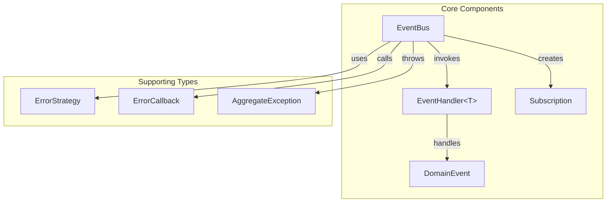

# Design Document: Core Event System

## Overview

This design document describes the architecture and implementation of Raiser's core event system. The system provides a type-safe, async-first event bus for Dart applications following clean architecture principles. The design prioritizes:

- Full generic type safety without dynamic casting
- Instance-first approach (no forced singletons)
- Non-invasive integration (no required base classes)
- Zero external dependencies

## Architecture



## Components and Interfaces

### 1. DomainEvent Base Class

The optional base class for domain events providing consistent metadata.

```dart
abstract class DomainEvent {
  /// Unique identifier for this event instance
  final String id;
  
  /// Timestamp when the event was created
  final DateTime timestamp;
  
  /// Optional aggregate ID for DDD patterns
  final String? aggregateId;
  
  DomainEvent({
    String? id,
    DateTime? timestamp,
    this.aggregateId,
  })  : id = id ?? _generateId(),
        timestamp = timestamp ?? DateTime.now();
  
  /// Converts event metadata to a Map for serialization
  Map<String, dynamic> toMetadataMap();
  
  /// Factory for reconstructing from metadata (subclasses implement)
  static DomainEvent fromMetadataMap(Map<String, dynamic> map);
}
```

### 2. EventHandler Interface

Generic interface for type-safe event handling.

```dart
abstract class EventHandler<T> {
  /// Handles an event of type T asynchronously
  Future<void> handle(T event);
}
```

### 3. Subscription

Represents a handler registration that can be cancelled.

```dart
class Subscription {
  final void Function() _cancel;
  bool _isCancelled = false;
  
  Subscription(this._cancel);
  
  bool get isCancelled => _isCancelled;
  
  void cancel() {
    if (!_isCancelled) {
      _isCancelled = true;
      _cancel();
    }
  }
}
```

### 4. ErrorStrategy Enum

Configures how the EventBus handles handler exceptions.

```dart
enum ErrorStrategy {
  /// Stop propagation on first error, rethrow immediately
  stop,
  
  /// Continue invoking all handlers, collect errors, throw aggregate at end
  continueOnError,
  
  /// Log errors via callback but don't throw, continue processing
  swallow,
}
```

### 5. AggregateException

Collects multiple errors when using `continueOnError` strategy.

```dart
class AggregateException implements Exception {
  final List<Object> errors;
  final List<StackTrace> stackTraces;
  
  AggregateException(this.errors, this.stackTraces);
  
  @override
  String toString() => 'AggregateException: ${errors.length} errors occurred';
}
```

### 6. EventBus

The central dispatcher for publishing events and managing handlers.

```dart
typedef ErrorCallback = void Function(Object error, StackTrace stackTrace);

class EventBus {
  final ErrorStrategy errorStrategy;
  final ErrorCallback? onError;
  
  EventBus({
    this.errorStrategy = ErrorStrategy.stop,
    this.onError,
  });
  
  /// Register a class-based handler with optional priority
  Subscription register<T>(EventHandler<T> handler, {int priority = 0});
  
  /// Register a function handler with optional priority
  Subscription on<T>(Future<void> Function(T event) handler, {int priority = 0});
  
  /// Publish an event to all registered handlers
  Future<void> publish<T>(T event);
}
```

## Data Models

### Handler Registration Entry

Internal structure for storing handler registrations:

```dart
class _HandlerEntry<T> {
  final Future<void> Function(T) handler;
  final int priority;
  final int registrationOrder;
  
  _HandlerEntry(this.handler, this.priority, this.registrationOrder);
}
```

### Type-Based Handler Storage

Handlers are stored in a map keyed by runtime type:

```dart
Map<Type, List<_HandlerEntry>> _handlers = {};
```


## Correctness Properties

*A property is a characteristic or behavior that should hold true across all valid executions of a system-essentially, a formal statement about what the system should do. Properties serve as the bridge between human-readable specifications and machine-verifiable correctness guarantees.*

### Property 1: Event ID Uniqueness

*For any* collection of DomainEvent instances created, all event IDs should be unique strings with no duplicates.

**Validates: Requirements 1.1**

### Property 2: Event Metadata Round-Trip

*For any* valid DomainEvent, serializing to a Map via `toMetadataMap()` and then reconstructing via `fromMetadataMap()` should produce an event with equivalent id, timestamp, and aggregateId values.

**Validates: Requirements 1.5, 1.6**

### Property 3: Aggregate ID Preservation

*For any* string provided as an aggregate ID during DomainEvent construction, the event's `aggregateId` property should return that exact string value.

**Validates: Requirements 1.3**

### Property 4: Handler Registration and Invocation

*For any* EventBus and any set of handlers registered for a given event type, publishing an event of that type should invoke all registered handlers exactly once each.

**Validates: Requirements 3.1, 3.2, 3.5, 3.7**

### Property 5: Subscription Cancellation Stops Delivery

*For any* subscription that has been cancelled, subsequent events published to the EventBus should not invoke the cancelled handler.

**Validates: Requirements 3.4**

### Property 6: Async Handler Completion

*For any* async handler that takes time to complete, the `publish()` Future should not complete until all handler Futures have completed.

**Validates: Requirements 3.3**

### Property 7: Registration Style Equivalence

*For any* event type, registering a handler via `register<T>(EventHandler<T>)` or via `on<T>(Function)` should result in equivalent invocation behavior when events are published.

**Validates: Requirements 4.1, 4.2**

### Property 8: Custom Event Type Routing

*For any* event type (whether extending DomainEvent or not), handlers registered for that exact type should receive published events of that type.

**Validates: Requirements 5.1, 5.2**

### Property 9: Priority-Based Handler Ordering

*For any* set of handlers registered with different priorities, handlers should be invoked in descending priority order. *For any* handlers with equal priority, they should be invoked in registration order.

**Validates: Requirements 6.2, 6.3**

### Property 10: Error Strategy Stop Halts Propagation

*For any* EventBus with `ErrorStrategy.stop`, when a handler throws an exception, no subsequent handlers should be invoked and the exception should propagate to the caller.

**Validates: Requirements 7.1**

### Property 11: Error Strategy ContinueOnError Collects All Errors

*For any* EventBus with `ErrorStrategy.continueOnError`, when handlers throw exceptions, all handlers should still be invoked and an AggregateException containing all errors should be thrown after completion.

**Validates: Requirements 7.2, 7.5**

### Property 12: Error Strategy Swallow Continues Silently

*For any* EventBus with `ErrorStrategy.swallow`, when handlers throw exceptions, all handlers should still be invoked and no exception should propagate to the caller.

**Validates: Requirements 7.3**

### Property 13: Error Callback Invocation

*For any* EventBus with an error callback configured, when a handler throws an exception, the callback should be invoked with that error and stack trace.

**Validates: Requirements 7.4**

## Error Handling

### Handler Exceptions

The EventBus handles exceptions based on the configured `ErrorStrategy`:

1. **Stop (default)**: First exception halts processing and propagates immediately
2. **ContinueOnError**: All handlers execute, errors collected, `AggregateException` thrown at end
3. **Swallow**: All handlers execute, errors passed to callback only (if configured)

### Error Callback

Optional callback receives all errors regardless of strategy:

```dart
final bus = EventBus(
  errorStrategy: ErrorStrategy.continueOnError,
  onError: (error, stackTrace) {
    logger.error('Handler failed', error, stackTrace);
  },
);
```

### Type Mismatches

Type mismatches are prevented at compile time through generics. Runtime type matching uses Dart's type system for handler lookup.

## Testing Strategy

### Property-Based Testing Library

The implementation will use the `glados` package for property-based testing in Dart. This library provides:
- Arbitrary generators for primitive and custom types
- Shrinking for minimal failing examples
- Configurable iteration counts

Each property test will run a minimum of 100 iterations.

### Unit Tests

Unit tests will cover:
- Basic instantiation and default values
- Edge cases (empty handlers, null aggregate IDs)
- Integration between components
- Error message formatting

### Property-Based Tests

Each correctness property will be implemented as a property-based test with explicit annotation:

```dart
// **Feature: core-event-system, Property 1: Event ID Uniqueness**
test('all event IDs are unique', () {
  Glados<List<TestEvent>>().test((events) {
    final ids = events.map((e) => e.id).toSet();
    expect(ids.length, equals(events.length));
  });
});
```

### Test File Organization

```
test/
├── domain_event_test.dart      # DomainEvent unit + property tests
├── event_handler_test.dart     # EventHandler interface tests
├── event_bus_test.dart         # EventBus unit + property tests
├── subscription_test.dart      # Subscription behavior tests
├── error_handling_test.dart    # Error strategy property tests
└── generators/
    └── test_generators.dart    # Custom Glados generators
```

### Custom Generators

Property tests require generators for:
- Random event instances with varying metadata
- Lists of handlers with random priorities
- Random error-throwing handlers
- Random subscription sequences (register/cancel)
